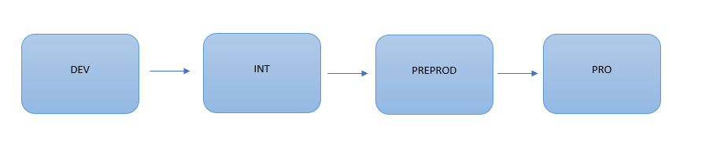

# Environments Model

There are four different types of environments: Development, Integration, Pre-Production, and Production.

- Development: environment where the development team implements new requirements.
- Integration: each project has its own Integration environment where new changes are tested before they are deployed to higher environments.
- Pre-Production: environments with characteristics similar to Production, where businesses integrate changes.
- Production: end-user environment.

The image below shows how environments are grouped by projects and business units, integrating in Pre-Production before deploying changes to Production.

