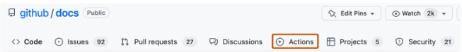
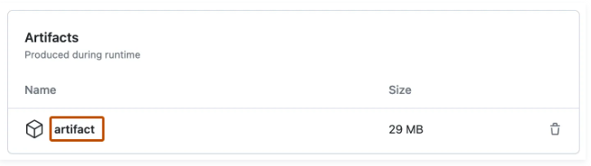

<h3><b><u>Download workflow artifacts</u></b></h3>

1. On GitHub.com, navigate to the main page of the repository.
2. Under your repository name, click  Actions.

3. In the left sidebar, click the workflow you want to see.
4. From the list of workflow runs, click the name of the run to see the workflow run summary.
5. Under Artifacts, click the artifact you want to download.

The result of the validation will create an artifact called validate.json and deploying successfully will generate deploy.json. These files contain the components that have been deployed to the organization.
