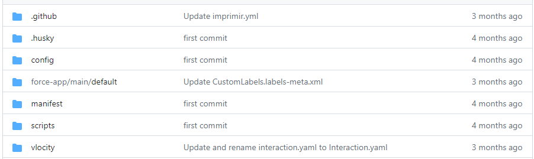
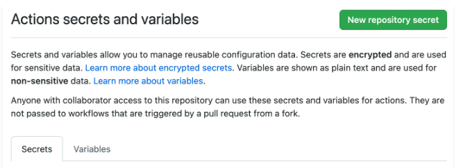

##  How does it work?  ##

  

<h3><b><u>Repository</u></b></h3>

  

A Git repository is a place where source code and its change history are stored and managed using the distributed version control system Git.

  
<h3>Folder structure:</h3>

-  <b>.github/workflows</b> - Folder that contains the pipelines.

-  <b>force-app/main/default</b> - Folder that contains the Salesforce environment code divided into their respective folders.

-  <b>vlocity</b> - Folder that contains the Vlocity code divided into their respective folders.

<h3><b><u>Creating encrypted secrets for a repository  </u></b></h3>

To create secrets or variables for a personal account repository, you must be the repository owner. To create secrets or variables for an organization repository,<b> you must have administrator access.</b>

1. On GitHub.com, navigate to the main page of the repository.
2. Under your repository name, click  Settings. If you cannot see the "Settings" tab, select the  dropdown menu, then click Settings.
3. In the "Security" section of the sidebar, select  Secrets and variables, then click Actions.
4. Click the Secrets tab.
5. Click New repository secret.
6. In the Name field, type a name for your secret.
7. In the Secret field, enter the value for your secret.
8. Click Add secret.

<h3>Git Clone:</h3>

To clone a repository from GitHub, you can follow these steps:

1. Go to the repository's GitHub page and copy the URL of the repository.

2. Open a terminal or command prompt on your computer and navigate to the directory where you want to clone the repository.

3. Type the command git clone followed by the URL of the repository. For example, if the URL of the repository is https://github.com/username/repo.git, you would type:

*git clone https://github.com/username/repo.git* Press Enter to execute the command.

Git will start downloading the repository to your local machine.

Once the cloning process is complete, you can navigate to the cloned directory and start working with the code.
