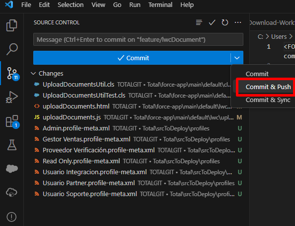

Add the changes we want to upload to the branch in the folder of our cloned repository. The changes will appear in the git extension for comparison. We click the Commit & Push button.

It is necessary to add a commit message to the commit.

