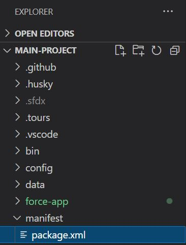
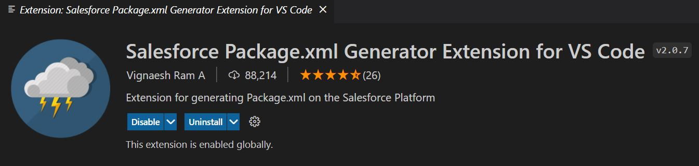
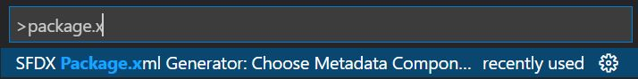
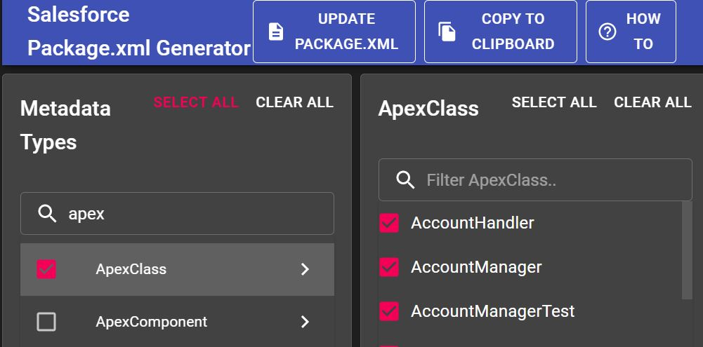

To download metadata from an Org, you need an XML file called package.xml, which details everything you need to download (retrieve). This file must be located inside a folder called manifest at the root level.

This folder can be generated at the time of SFDX project creation, by selecting the option to create a project with the manifest folder, or if it doesn't exist, you must create it manually.

You can manually create the package.xml or use a Visual Studio Code extension called Salesforce Package.xml Generator Extension for VS Code.

# Using package.xml

## Prepare the Package.xml file

To use the extension, press Ctrl + Shift + P (Windows) or Command + Shift + P (Mac) and select SFDX Package.xml Generator.

This will open a selector to choose the metadata components in your Org that you want to include in your package.xml. Once you have selected everything, click the Update package.xml button to generate the file for metadata download.

## Download metadata using package.xml

Once you have a package.xml file that lists all the names and types of metadata that you want to download from the Org, you can retrieve it in two ways:

- Inside the file, right-click and select SFDX: Retrieve Source in Manifest from Org.
- In the browser, right-click the package.xml file, and select SFDX: Deploy Source in Manifest from Org.

*Note: Be careful with the selected Org to download and/or upload metadata.*
